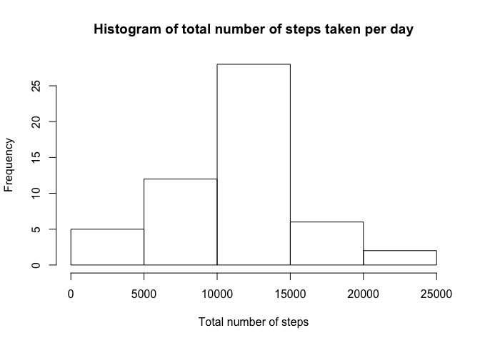
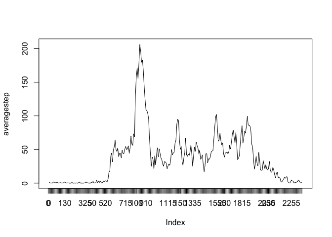
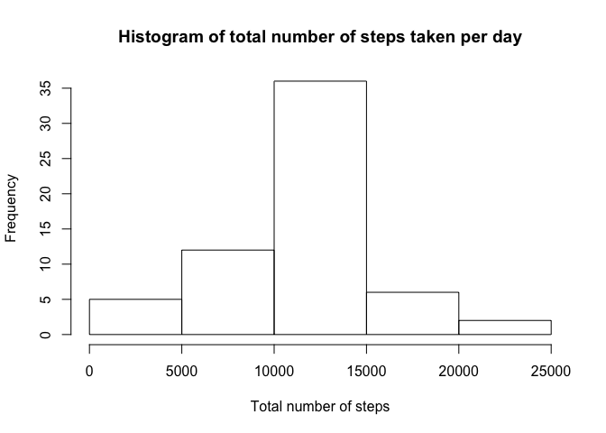
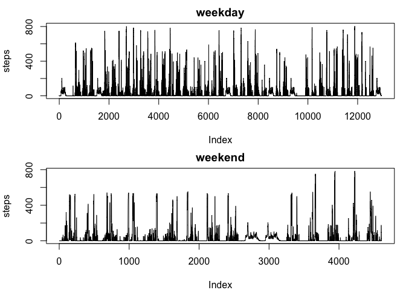

## Loading and preprocessing the data

```r
knitr::opts_chunk$set(echo = TRUE)
activity<-read.csv(file="activity.csv")
```
## What is mean total number of steps taken per day?

```r
totalstep<-tapply(activity$steps,activity$date,sum)
hist(totalstep,main = "Histogram of total number of steps taken per day", xlab = "Total number of steps")
```

<!-- -->

```r
mean(totalstep,na.rm =T)
```

```
## [1] 10766.19
```

```r
median(totalstep,na.rm =T)
```

```
## [1] 10765
```

## What is the average daily activity pattern?


```r
averagestep<-tapply(activity$steps,activity$interval,mean,na.rm =T)
plot(averagestep,type="l")
axis(1,at=1:288,labels = rownames(averagestep))
```

<!-- -->

```r
max(averagestep)
```

```
## [1] 206.1698
```

```r
which.max(averagestep)
```

```
## 835 
## 104
```
## Imputing missing values

```r
sum(is.na(activity$steps))
```

```
## [1] 2304
```

```r
newactivity<-activity
averagestep<-as.data.frame(averagestep)
library(tibble)
averagestep<-rownames_to_column(averagestep)
colnames(averagestep)<-c("interval","averagesteps")
library(dplyr)
```

```
## 
## Attaching package: 'dplyr'
```

```
## The following objects are masked from 'package:stats':
## 
##     filter, lag
```

```
## The following objects are masked from 'package:base':
## 
##     intersect, setdiff, setequal, union
```

```r
averagestep$interval<-as.integer(averagestep$interval)
newactivity<-left_join(newactivity,averagestep)
```

```
## Joining, by = "interval"
```

```r
for (i in 1:17568){
    if (is.na(newactivity$steps[i])==T){
    newactivity$steps[i]=newactivity$averagesteps[i]}
    else{}
}
newactivity$averagesteps<-NULL
newtotalstep<-tapply(newactivity$steps,newactivity$date,sum)
hist(newtotalstep,main = "Histogram of total number of steps taken per day", xlab = "Total number of steps")
```

<!-- -->

```r
mean(newtotalstep)
```

```
## [1] 10766.19
```

```r
median(newtotalstep)
```

```
## [1] 10766.19
```
These values are different from the estimates from the first part of the assignment. Imputing missing data makes the dataset more accurate compared to the original one.

## Are there differences in activity patterns between weekdays and weekends?

```r
newactivity$day <- weekdays(as.Date(newactivity$date))
newactivity$day <- ifelse((newactivity$day) %in% c("Saturday", "Sunday"), "weekend", "weekday")
par(mfrow=c(2,1),mar=c(4,4,2,1))
with(subset(newactivity,day=="weekday"),plot(steps,main="weekday",type="l"))
with(subset(newactivity,day=="weekend"),plot(steps,main="weekend",type="l"))
```

<!-- -->

